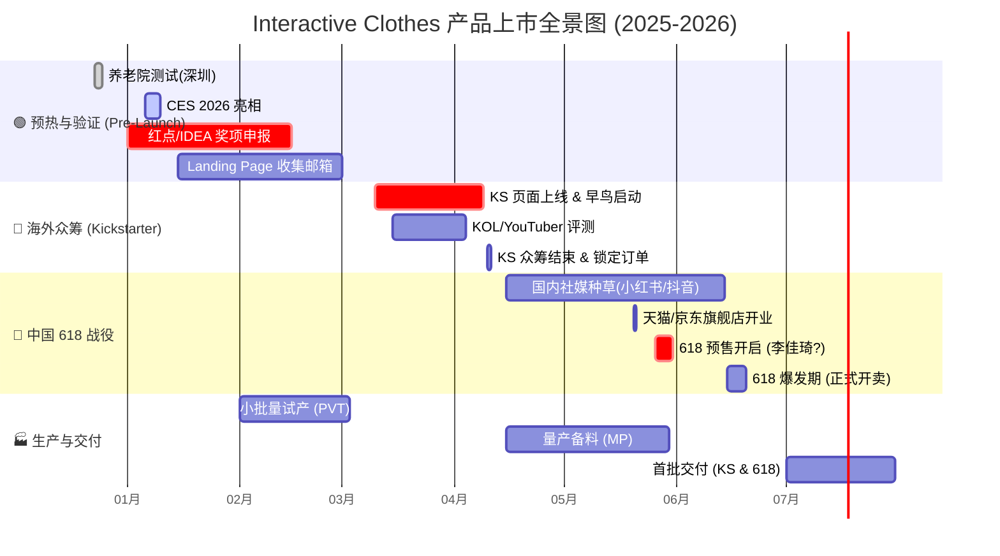
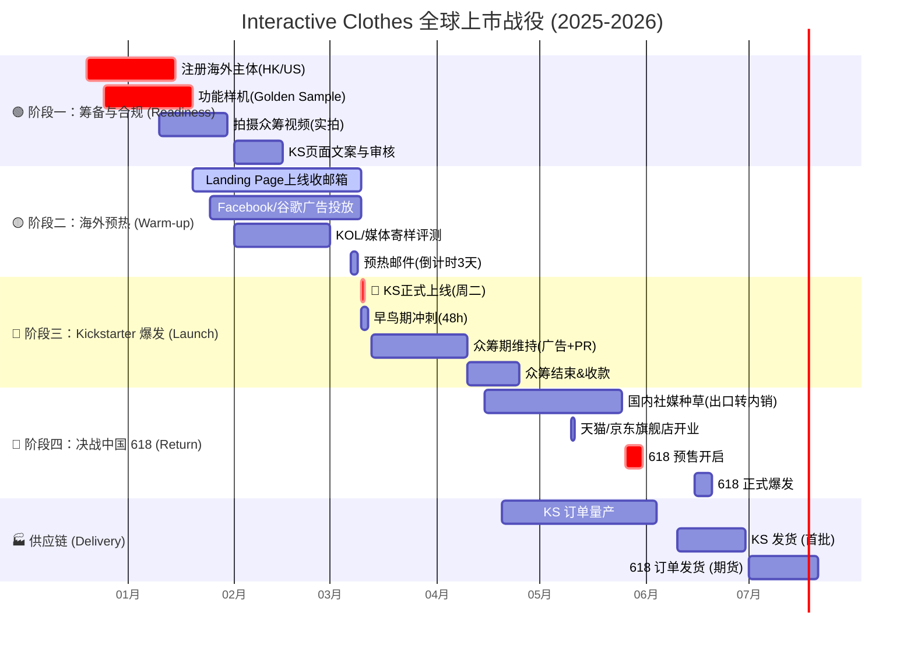

### 1\. 可视化时间轴 (Mermaid Gantt Chart)

-----

#### **第一阶段：Pre-Launch & 背书积累 (2025.12 - 2026.02)**

  * **目标：** 收集素材，积累信任状，为众准备。
  * **关键动作：**
      * **12月23-24日：** 完成深圳养老院测试，拍摄“老人笑脸”视频素材。
      * **1月16日前：** **Red Dot Product Design** 报名，拿到入围资格（Nominee）也可以是宣传点。
      * **1月 CES：** 拍摄现场体验者的反应视频（Social Proof），争取获得 TechCrunch 或 Engadget 等媒体报道。
      * **2月：** 搭建 Landing Page（着陆页），通过官网预约、社交媒体预热、行业 KOL 合作, 以“获得早鸟 40% OFF(百分比可以再定)”为诱饵，积累至少 5000 人的预启动邮件列表

#### **第二阶段：Kickstarter  (2026.03 - 2026.04)** (周二目标时区上午 8-10 点）

  * **目标：** 验证市场需求，获取第一笔美金现金流，制造“爆款”新闻。
  * **策略：** **"Tech for Good" (科技向善)**
      * **早鸟价 (Super Early Bird):** 设定限量 500 套，价格极其诱人（如 $199），制造“秒空”假象。
      * **PR 配合：** 此时如果有 Dyson Award 或 Red Dot 的入围消息，立刻在 Update 中发布，刺激观望者下单。
      * 数据显示，首日达成融资目标 30% 以上的项目，最终成功率超 70%。
      * 启动前 3 天发送倒计时邮件，强调 “限时早鸟优惠”，激发首日转化。
      * 建议早鸟优惠持续 24-48 小时，覆盖启动日当天及次日上午，利用 “时间稀缺性” 刺激即时转化。
          * 例如：EST 周二 9 点启动，早鸟优惠截止到周三 12 点，完整覆盖两个工作日的晨间高峰。
      * 启动后第 1 小时是问题爆发期（如链接错误、库存显示异常），确保团队在目标时区的工作时间内随时待命，避免技术故障消耗用户信任

#### **第三阶段：出口转内销 & 618 预售 (2026.05 - 2026.06)**

  * **目标：** 利用海外热度，在中国市场收割“孝心经济”和“极客玩家”。
  * **策略：** **"海外爆红的黑科技，终于回国了"**
      * **5月1日-20日 (种草期):**
          * **小红书：** 投放“送长辈礼物”、“科技助老”话题。博主晒单：“在国外众筹抢疯了的拍拍衣，专门治爸妈肩膀痛”。
          * **知乎/B站：** 硬核拆解，强调 HCI 技术和无订阅良心模式。
      * **5月26日 (预售启动):**
          * 参加天猫/京东 **618 预售 (Pre-sale)**。
          * **话术：** "红点奖设计，CES 明星产品，首批回国限量 2000 件"。
      * **6月15日-18日 (爆发期):**
          * 集中转化。如果产能跟不上，可以卖“现货+期货”（6月发一部分，7月发一部分）。

#### **第四阶段：生产与交付 (2026.07 - 2026.08)**

  * **目标：** 确保口碑，不炸单。
  * **关键点：**
      * **优先发货原则：** 建议优先发 Kickstarter 早期支持者（避免海外差评），紧接着发 618 首批用户。
      * **私域沉淀：** 在包装盒里放“添加康复顾问微信”的卡片，将 618 用户沉淀到私域，进行后续的社群运营和裂变。

-----

### ⚠️ 风险提示 (Risk Management)

1.   618 的发货时间点（6月中下旬）和 Kickstarter 的发货承诺（通常是众筹结束后 3个月，即 7月）非常接近。
      * *对策：* 618 务必设置为\*\*“预售模式” (Pre-order)\*\*，承诺 30-45 天发货，给自己留足缓冲期，不要承诺“次日达”。
2.   假如 Kickstarter 卖 $199 (约 ¥1400)，国内 618 绝对不能卖得比这个贵太多，也不能太便宜导致海外用户退款。

这是一份基于你提供的 **Kickstarter 最佳实践文档**（最佳时间、审核要求、预热逻辑）以及 **中国 618 大促节奏** 深度定制的产品上市时间轴。

**核心战略冲突与解决：**

* **文档建议：** 5月是众筹最佳月份，且科技类多在3-4月。
* **现实冲突：** 如果等到5月才上 Kickstarter，会完美错过中国 618（5月底就开始预售）的造势窗口。
* **最优解：** 选择 **3月中旬（周二）** 启动众筹。既符合“科技类旺季（3-4月）”，又能赶在4月中旬结束，留出1.5个月的时间将“海外爆款”的热度传回国内，引爆 618。

---

### 1. 可视化全景时间轴 (Mermaid Gantt)

---

### 2. 详细执行策略 (Based on Provided Documents)

#### **阶段一：基建与合规 (2025.12 - 2026.01)**

* **核心任务：** 搞定“身份”和“素材”。
* **依据来源：**
* *Kickstarter 只支持 25 个特定国家/地区发起（如美国、香港）。*
* *审核必须有“功能性样品演示实拍”，不能只用渲染图。*

* **行动清单：**
1. **主体注册：** 注册 **香港公司 (HK Entity)** 或 **美国公司**。准备好法人护照、信用卡（Visa/Mastercard）、美金/港币收款账户（如 PingPong/Airwallex）。
2. **样机准备：** 确保有一台能完美演示“拍打+音乐互动”的工程机，拍摄 **无特效实拍视频 (Demo Video)** 用于通过 KS 官方审核。
3. **Landing Page 搭建：** 建立单页网站，核心目的是 **收集 Email**。接入 Google Analytics 追踪流量来源。

#### **阶段二：蓄水预热 (2026.01.20 - 2026.03.09)**

* **核心任务：** 积累 5000+ 种子用户邮箱。
* **依据来源：**
* *首日爆发决定成败；需要留 1-1.5 个月预热。*
* *通过 Landing Page 收集邮箱，目标是首日完成 30%-50% 众筹目标。*

* **行动清单：**
1. **广告投放 (Meta Ads)：** 投放“早鸟优惠即将开启”广告，引导用户留下邮箱。
2. **KOL 寄样：** 利用 BuzzSumo 等工具筛选科技/康养类网红，寄送样机。目标是在上线当天有 3-5 个 YouTube 视频同时发布。
3. **邮件营销 (EDM)：**
* 上线前 1 周：公布价格区间，强调“限时早鸟价 (Super Early Bird)”。
* 上线前 3 天：倒计时，制造紧迫感。

#### **阶段三：Kickstarter 引爆 (2026.03.10 - 2026.04.10)**

* **核心任务：** 抢占首页，冲刺金额。
* **依据来源：**
* *最佳启动时间：周二，EST 上午 8-10 点。*
* *科技类项目集中在 3-4 月启动。*

* **Launch Day (2026.03.10, Tuesday, 9:00 AM EST)：**
* **早鸟策略：** 设置 **Super Early Bird (限时 48 小时)**，折扣力度最大（如 $199 vs 零售价 $299），刺激 Email 列表里的种子用户在第 1 小时下单。
* **流量承接：** 联系 **Kickbooster** 做纯佣带货；联系 **Pledge Box** 在项目结束后做追加销售 (Add-on)。
* **客服待命：** 确保团队在 EST 时间在线，处理支付失败或咨询问题。

#### **阶段四：出口转内销 & 618 预售 (2026.04.15 - 2026.06.18)**

* **核心任务：** 利用“墙外开花墙内香”的心理，收割国内市场。
* **依据来源：**
* *非首发新品会导致 KS 审核不通过（所以必须 KS 先发，国内后发）。*

* **营销话术转换：**
* KS 成绩单 \rightarrow **“并在海外众筹平台 Kickstarter 斩获 $$XXX,XXX 美金，获得红点奖设计认证”**。
* 用户评价 \rightarrow 截取 KS 评论区老外的真实好评，翻译成中文做成详情页海报。

* **618 节奏：**
* **5月26日 (预售启动)：** 上架天猫/京东。利用“海外爆款首发回国”噱头，开启定金预售。
* **6月15-18日 (爆发期)：** 配合父亲节（6月第三个周日，通常在 618 期间），主打“送给父母的科技潮礼”。

---

### 3. 关键风险与应对 (Risk Management)

| 风险点 | 来源依据 | 应对策略 |
| --- | --- | --- |
| **审核拒搞** | *KS禁止使用渲染图展示产品，必须有功能性样品* | 拍摄视频时务必包含一段**一镜到底**的功能演示（手拍衣服 -> 衣服发光/震动 -> APP响应），证明不是特效。 |
| **发货延期** | *项目众筹成功后，没发货的Creator属于违规* | 618 销售时，务必设置为 **“45天预售发货”**。优先满足 KS 用户的发货（避免海外投诉退款），随后发国内。 |
| **价格穿底** | *非首发新品、线上线下销售过的商品不行* | 严禁在 4月10日 KS 结束前在国内任何平台（闲鱼、淘宝）上架销售，否则 KS 会强行下架项目并冻结资金。 |
| **流量断层** | *依靠平台内流量完全不够* | 必须准备 **$5,000 - $10,000** 的前期广告预算用于 Facebook/Instagram 引流到 Landing Page。 |

**总结：** 这个时间轴利用 **3月** 的海外众筹黄金期（科技类旺季+周二发布），完美避开了 **12月** 的“消费红海”，并为 **6月** 的国内大促积累了最宝贵的“势能”和“信任背书”。
