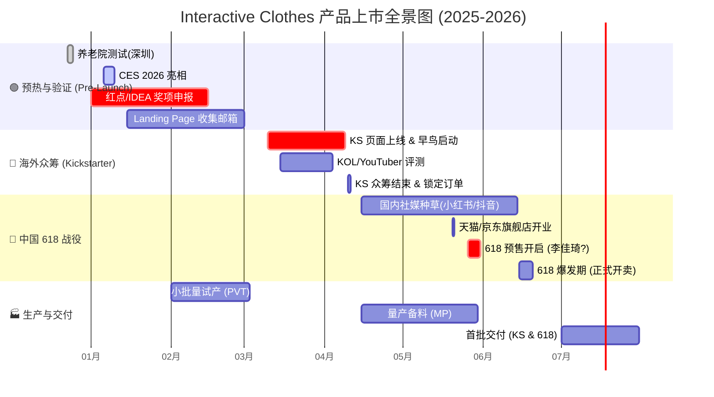
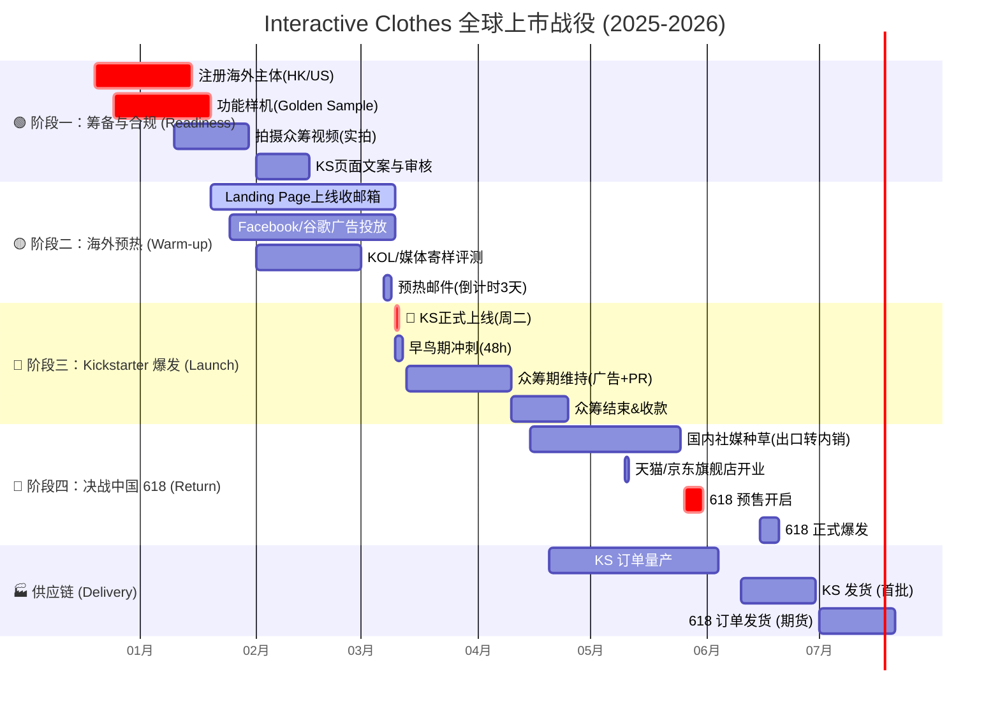
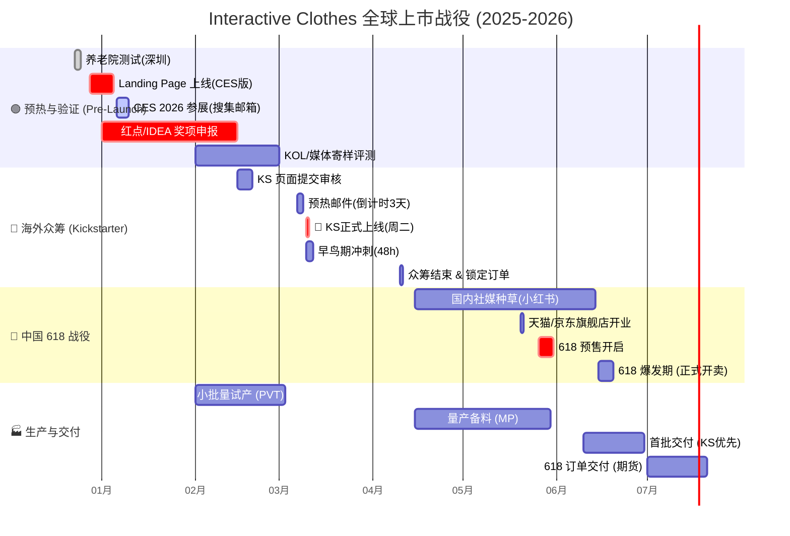

### 1\. 可视化时间轴 (Mermaid Gantt Chart)

-----

#### **第一阶段：Pre-Launch & 背书积累 (2025.12 - 2026.02)**

  * **目标：** 收集素材，积累信任状，为众准备。
  * **关键动作：**
      * **12月23-24日：** 完成深圳养老院测试，拍摄“老人笑脸”视频素材。
      * **1月16日前：** **Red Dot Product Design** 报名，拿到入围资格也可以是宣传点。
      * **1月 CES：** 拍摄现场体验者的反应视频（Social Proof），争取获得 TechCrunch 或 Engadget 等媒体报道。
      * **2月：** 搭建 Landing Page，通过官网预约、社交媒体预热、行业 KOL 合作, 以“获得早鸟 40% OFF(百分比可以再定)”为诱饵，积累至少 5000 人的预启动邮件列表

#### **第二阶段：Kickstarter  (2026.03 - 2026.04)** (周二目标时区上午 8-10 点）

  * **目标：** 验证市场需求，获取第一笔美金现金流，制造“爆款”新闻。
  * **策略：** **"Tech for Good" (科技向善)**
      * **早鸟价 (Super Early Bird):** 设定限量 500 套，价格极其诱人（如 $199），制造“秒空”假象。
      * **PR 配合：** 此时如果有 Dyson Award 或 Red Dot 的入围消息，立刻在 Update 中发布，刺激观望者下单。
      * 数据显示，首日达成融资目标 30% 以上的项目，最终成功率超 70%。
      * 启动前 3 天发送倒计时邮件，强调 “限时早鸟优惠”，激发首日转化。
      * 建议早鸟优惠持续 24-48 小时，覆盖启动日当天及次日上午，利用 “时间稀缺性” 刺激即时转化。
          * 例如：EST 周二 9 点启动，早鸟优惠截止到周三 12 点，完整覆盖两个工作日的晨间高峰。
      * 启动后第 1 小时是问题爆发期（如链接错误、库存显示异常），确保团队在目标时区的工作时间内随时待命，避免技术故障消耗用户信任

#### **第三阶段：出口转内销 & 618 预售 (2026.05 - 2026.06)**

  * **目标：** 利用海外热度，在中国市场收割“孝心经济”和“极客玩家”。
  * **策略：** **"海外爆红的黑科技，终于回国了"**
      * **5月1日-20日 (种草期):**
          * **小红书：** 投放“送长辈礼物”、“科技助老”话题。博主晒单：“在国外众筹抢疯了的拍拍衣，专门治爸妈肩膀痛”。
          * **知乎/B站：** 硬核拆解，强调 HCI 技术和无订阅良心模式。
      * **5月26日 (预售启动):**
          * 参加天猫/京东 **618 预售 (Pre-sale)**。
          * **话术：** "红点奖设计，CES 明星产品，首批回国限量 2000 件"。
      * **6月15日-18日 (爆发期):**
          * 集中转化。如果产能跟不上，可以卖“现货+期货”（6月发一部分，7月发一部分）。

#### **第四阶段：生产与交付 (2026.07 - 2026.08)**

  * **目标：** 确保口碑，不炸单。
  * **关键点：**
      * **优先发货原则：** 建议优先发 Kickstarter 早期支持者（避免海外差评），紧接着发 618 首批用户。
      * **私域沉淀：** 在包装盒里放“添加康复顾问微信”的卡片，将 618 用户沉淀到私域，进行后续的社群运营和裂变。

-----

### ⚠️ 风险提示 (Risk Management)

1.   618 的发货时间点（6月中下旬）和 Kickstarter 的发货承诺（通常是众筹结束后 3个月，即 7月）非常接近。
      * *对策：* 618 务必设置为\*\*“预售模式” (Pre-order)\*\*，承诺 30-45 天发货，给自己留足缓冲期，不要承诺“次日达”。
2.   假如 Kickstarter 卖 $199 (约 ¥1400)，国内 618 绝对不能卖得比这个贵太多，也不能太便宜导致海外用户退款。

这是一份基于你提供的 **Kickstarter 最佳实践文档**（最佳时间、审核要求、预热逻辑）以及 **中国 618 大促节奏** 深度定制的产品上市时间轴。

**核心战略冲突与解决：**

* **文档建议：** 5月是众筹最佳月份，且科技类多在3-4月。
* **现实冲突：** 如果等到5月才上 Kickstarter，会完美错过中国 618（5月底就开始预售）的造势窗口。
* **最优解：** 选择 **3月中旬（周二）** 启动众筹。既符合“科技类旺季（3-4月）”，又能赶在4月中旬结束，留出1.5个月的时间将“海外爆款”的热度传回国内，引爆 618。

---

### 1. 可视化全景时间轴 (Mermaid Gantt)

---

### 2. 详细执行策略 (Based on Provided Documents)

#### **阶段一：基建与合规 (2025.12 - 2026.01)**

* **核心任务：** 搞定“身份”和“素材”。
* **依据来源：**
* *Kickstarter 只支持 25 个特定国家/地区发起（如美国、香港）。*
* *审核必须有“功能性样品演示实拍”，不能只用渲染图。*

* **行动清单：**
1. **主体注册：** 注册 **香港公司 (HK Entity)** 或 **美国公司**。准备好法人护照、信用卡（Visa/Mastercard）、美金/港币收款账户（如 PingPong/Airwallex）。
2. **样机准备：** 确保有一台能完美演示“拍打+音乐互动”的工程机，拍摄 **无特效实拍视频 (Demo Video)** 用于通过 KS 官方审核。
3. **Landing Page 搭建：** 建立单页网站，核心目的是 **收集 Email**。接入 Google Analytics 追踪流量来源。

#### **阶段二：蓄水预热 (2026.01.20 - 2026.03.09)**

* **核心任务：** 积累 5000+ 种子用户邮箱。
* **依据来源：**
* *首日爆发决定成败；需要留 1-1.5 个月预热。*
* *通过 Landing Page 收集邮箱，目标是首日完成 30%-50% 众筹目标。*

* **行动清单：**
1. **广告投放 (Meta Ads)：** 投放“早鸟优惠即将开启”广告，引导用户留下邮箱。
2. **KOL 寄样：** 利用 BuzzSumo 等工具筛选科技/康养类网红，寄送样机。目标是在上线当天有 3-5 个 YouTube 视频同时发布。
3. **邮件营销 (EDM)：**
* 上线前 1 周：公布价格区间，强调“限时早鸟价 (Super Early Bird)”。
* 上线前 3 天：倒计时，制造紧迫感。

#### **阶段三：Kickstarter 引爆 (2026.03.10 - 2026.04.10)**

* **核心任务：** 抢占首页，冲刺金额。
* **依据来源：**
* *最佳启动时间：周二，EST 上午 8-10 点。*
* *科技类项目集中在 3-4 月启动。*

* **Launch Day (2026.03.10, Tuesday, 9:00 AM EST)：**
* **早鸟策略：** 设置 **Super Early Bird (限时 48 小时)**，折扣力度最大（如 $199 vs 零售价 $299），刺激 Email 列表里的种子用户在第 1 小时下单。
* **流量承接：** 联系 **Kickbooster** 做纯佣带货；联系 **Pledge Box** 在项目结束后做追加销售 (Add-on)。
* **客服待命：** 确保团队在 EST 时间在线，处理支付失败或咨询问题。

#### **阶段四：出口转内销 & 618 预售 (2026.04.15 - 2026.06.18)**

* **核心任务：** 利用“墙外开花墙内香”的心理，收割国内市场。
* **依据来源：**
* *非首发新品会导致 KS 审核不通过（所以必须 KS 先发，国内后发）。*

* **营销话术转换：**
* KS 成绩单 \rightarrow **“并在海外众筹平台 Kickstarter 斩获 $$XXX,XXX 美金，获得红点奖设计认证”**。
* 用户评价 \rightarrow 截取 KS 评论区老外的真实好评，翻译成中文做成详情页海报。

* **618 节奏：**
* **5月26日 (预售启动)：** 上架天猫/京东。利用“海外爆款首发回国”噱头，开启定金预售。
* **6月15-18日 (爆发期)：** 配合父亲节（6月第三个周日，通常在 618 期间），主打“送给父母的科技潮礼”。

---

### 3. 关键风险与应对 (Risk Management)

| 风险点 | 来源依据 | 应对策略 |
| --- | --- | --- |
| **审核拒搞** | *KS禁止使用渲染图展示产品，必须有功能性样品* | 拍摄视频时务必包含一段**一镜到底**的功能演示（手拍衣服 -> 衣服发光/震动 -> APP响应），证明不是特效。 |
| **发货延期** | *项目众筹成功后，没发货的Creator属于违规* | 618 销售时，务必设置为 **“45天预售发货”**。优先满足 KS 用户的发货（避免海外投诉退款），随后发国内。 |
| **价格穿底** | *非首发新品、线上线下销售过的商品不行* | 严禁在 4月10日 KS 结束前在国内任何平台（闲鱼、淘宝）上架销售，否则 KS 会强行下架项目并冻结资金。 |
| **流量断层** | *依靠平台内流量完全不够* | 必须准备 **$5,000 - $10,000** 的前期广告预算用于 Facebook/Instagram 引流到 Landing Page。 |

### 1. 修正后的可视化时间轴 (Mermaid Gantt Chart)

主要变化：Landing Page 提前至 12 月底上线，覆盖 CES 全程。

---

### 2. 详细执行策略 (Detailed Execution Plan)

#### **第一阶段：CES 蓄水与背书 (2025.12 - 2026.02)**

* **目标：** 利用 CES 流量完成第一批种子用户积累（目标：现场收集 500+ 高质量行业邮箱，线上收集 2000+）。
* **关键动作：**
* 
**Landing Page 上线 (12月30日前)：** 必须在出发去拉斯维加斯前上线。它是所有流量的汇集地 。

* **CES 现场执行 (1月6-9日)：**
* 展位必须有巨大的 **QR Code**，话术：“Scan to get 40% OFF Super Early Bird Price” (扫码获早鸟优惠)。
* 拍摄现场体验者的反应视频（Social Proof），作为后续 KS 页面素材。

* **奖项背书 (1月16日前)：** 完成 Red Dot 报名，即便只是 "Submitted" 状态也可以在话术中提及“参选红点奖”。

#### **第二阶段：Kickstarter 引爆 (2026.03 - 2026.04)**

* **启动时间：** **3月10日 (周二) 美东时间上午 8:00 - 10:00 (EST)**。
* 
*理由：* 避开周一综合征，利用周二的高用户参与度 。上午 8-10 点是职场人和学生大脑活跃度最高的时段 。

* **核心策略：**
* 
**Email 列表轰炸：** 在上线前积累 **5000+ 邮箱** 。利用 CES 收集的邮箱 + 广告投放引流。

* 
**首日目标：** 必须在 24 小时内完成 **30%-50%** 的众筹目标，这样才能触发 Kickstarter 的算法推荐，获得首页流量 。

* 
**早鸟限时 (Time Scarcity)：** 设置 **48小时** 的 "Super Early Bird" 档位，利用时间稀缺性刺激 CES 期间关注的用户立即转化 。

* 
**审核准备：** 提前 7 个工作日提交审核 。必须上传**无特效的产品功能实拍视频**，证明产品真实可用，不能只用渲染图 。

---

### 3. CES 专属 Landing Page 内容规划

Landing Page 是你产品的小官网，也是 CES 流量的着陆点 。

**页面结构建议：**

| 板块 (Section) | 内容要点 (Content Strategy) | 目的 |
| --- | --- | --- |
| **1. Hero Section** 

 (首屏海报) | **标题:** "Interactive Clothes: The Rhythm of Health." 

 **副标题:** "Relieve stiffness and stress with haptic therapy. Coming soon to Kickstarter." 

 **CTA 按钮:** **[ Get 40% OFF Launch Invite ]** (点击弹窗输邮箱) | 3秒内抓住用户，获取邮箱 。

 |
| **2. CES Invitation** 

 (展会信息) | **Headline:** "Meet us at CES 2026!" 

 **Location:** **Venetian Expo, Hall G, Booth #5xxxx** (具体展位号) 

 **Map:** 一张简单的展馆地图指引。 

 **Action:** "Book a Demo Slot" (预约演示，收集更多联系人信息)。 | 指引现场观众，增加信任感。 |
| **3. The Problem & Solution** 

 (痛点与方案) | **Visual:** 对比图（晨僵痛苦 vs 穿戴后的轻松）。 

 **Text:** "No setup. No pills. Just wear and play." (零门槛，无药，穿上即玩)。 

 强调 **"Non-invasive"** (非侵入式) 和 **"Fun"** (有趣)。 | 快速教育用户产品价值。 |
| **4. Social Proof** 

 (信任背书) | **Logos:** InnoX, Shenzhen University, (Red Dot Nominee - if applied). 

 **Testimonials:** 放 1-2 句养老院测试时的老人/护工反馈：“My shoulders feel lighter!” | 建立可信度 。

 |
| **5. Footer & Tracking** 

 (底部与追踪) | **Contact:** Business Email, LinkedIn. 

 **Tech:** 务必安装 **Google Analytics** 和 **Meta Pixel**。 | 追踪 CES 期间的流量来源，为后续广告投放做数据积累 。

 |

# 🚀 Interactive Clothes：全球商业化与奖项全景执行计划 (2025-2026)

---

## 📅 阶段一：信任资产积累与预热 (2025.12 - 2026.01)
**核心目标：** 完成产品验证，利用 CES 和红点奖建立第一波信任背书，收集首批 2500+ 种子邮箱。

### **2025年 12月**
* **12月23-24日 [验证]：** **深圳养老院产品测试**。
    * *动作：* 采集老人使用的真实反馈视频（笑容/惊讶表情），作为 Kickstarter 视频的感性素材。
* **12月28日 [基建]：** **CES Landing Page (落地页) 正式上线**。
    * *内容：* 展位指引 + 痛点海报 + **"Sign up for 40% OFF Super Early Bird（percentage可以再定）"** 诱饵。
    * *技术：* 埋设 Meta Pixel 和 Google Analytics 用于后续广告再营销。

### **2026年 1月**
* **1月05日 [奖项]：** **IDEA 2026 (美国工业设计奖) 报名开启**。
* **1月06日 [奖项]：** **Core77 Design Awards (专业组) 报名开启**。
* **1月06-09日 [流量]：** **🇺🇸 CES 2026 拉斯维加斯参展**。
    * *现场执行：* 展位设置巨大二维码引导扫码订阅；拍摄 KOL/行业专家体验视频 (Social Proof)。
    * *目标：* 现场收集 500+ 高质量 B 端/极客邮箱。
* **1月16日 [奖项]：** **🛑 Red Dot Award: Product Design (Latecomer 截止)**。
    * *极度紧急：* 必须在此日期前完成注册缴费 (€890)。
    * *话术：* 报名后即可在营销中使用 "Red Dot Award Participant" 增加信任。
* **1月20日 [研发]：** 根据 CES 反馈微调工程机，锁定 PVT (试产) 规格。

---

## 📅 阶段二：生产准备与众筹蓄水 (2026.02)
**核心目标：** 搞定合规，扩大邮箱列表至 5000+，寄送评测样机。

### **2026年 2月**
* **2月01日 [生产]：** **PVT (小批量试产) 启动**。确保有 50-100 台完美样机用于媒体评测。
* **2月01-20日 [营销]：** **KOL/YouTuber 寄样**。
    * *对象：* 科技 (Tech)、康养 (Wellness)、极客 (Gadget) 类博主。
    * *要求：* 约定在 3月10日 众筹当天发布开箱视频。
* **2月09-27日 [奖项]：** **Red Dot 实物寄送**。
    * *物流：* 将一台功能完美的 Golden Sample 寄往德国 Essen 评审中心 (注意锂电池清关)。
* **2月15-20日 [合规]：** **Kickstarter 页面提交审核**。
    * *关键：* 上传**无特效实拍演示视频**，证明产品功能真实，防止被拒。
* **2月28日 [奖项]：** **A' Design Award (Late 截止)**。

---

## 📅 阶段三：Kickstarter 引爆月 (2026.03)
**核心目标：** **3月10日上线**，24小时内达成 50% 目标，制造"海外爆款"现象。

### **2026年 3月**
* **3月01日 [奖项]：** **UX Design Awards (秋季赛) 报名开启**。
* **3月07-09日 [预热]：** **Email 倒计时轰炸**。
    * *策略：* 发送 3 封邮件 (T-3, T-1, Launch Now)，反复强调 "Super Early Bird 限时限量"。
* **3月10日 (周二) [爆发]：** **🚀 Kickstarter 正式上线 (9:00 AM EST)**。
    * *策略：* 开启 **48小时限时 Super Early Bird ($199 vs $299)（percentage可以再定）**。
    * *广告：* Facebook/Instagram Ads 全量投放，ROAS 目标 > 3.0。
* **3月11日 [奖项]：** **IDEA 2026 (常规截止)** 🛑。
* **3月17日 [奖项]：** **Golden Pin (金点设计奖) 报名开启**。
* **3月27日 [奖项]：** **Core77 (常规截止)** 🛑。

---

## 📅 阶段四：众筹收官与出口转内销 (2026.04)
**核心目标：** 锁定海外订单，开启国内种草，利用"海外成绩"降维打击。

### **2026年 4月**
* **4月01日 [奖项]：** **🇯🇵 Good Design Award (G-Mark) 报名开启**。
    * *战略：* 为进军日本养老市场做铺垫。
* **4月10日 [收官]：** **Kickstarter 众筹结束**。
    * *动作：* 锁定最终订单量，向工厂下达 MP (量产) 指令。
    * *追加销售：* 使用 PledgeBox 进行配件 (如替换绑带、收纳包) 的 Upsell。
* **4月15日 [生产]：** **MP (大规模量产) 备料启动**。
* **4月15日+ [国内营销]：** **"出口转内销" 种草启动**。
    * *渠道：* 小红书、抖音、知乎。
    * *话术：* "海外众筹超 50万美金"、"红点奖入围"、"CES 明星产品终于回国"。
* **4月25日 [奖项]：** **Fast Company Innovation Awards (截止)** 🛑。

---

## 📅 阶段五：决战中国 618 (2026.05 - 2026.06)
**核心目标：** 利用父亲节节点，收割国内"孝心经济"。

### **2026年 5月**
* **5月10日 [渠道]：** **天猫/京东旗舰店装修上线** (仅展示，不可买)。
* **5月15日 [奖项]：** **🇩🇪 iF DESIGN AWARD 2027 (早鸟开启)**。
    * *布局：* 提前锁定明年的商业奖项。
* **5月20日 [营销]：** 520 礼遇季小规模测试 (Test Run)。
* **5月22日 [奖项]：** **G-Mark (报名截止)** 🛑。
* **5月26日 [销售]：** **🇨🇳 618 预售开启 (Pre-sale)**。
    * *策略：* 支付定金锁单。
    * *风控：* 必须设置为 **"预售 45 天发货"** (避开 KS 发货期，防止价格/发货顺序冲突)。

### **2026年 6月**
* **6月10日 [交付]：** **🚢 KS 首批订单优先发货**。
    * *原则：* 必须优先满足海外众筹用户，避免退款和公关危机。
* **6月15-20日 [爆发]：** **618 正式爆发期**。
    * *场景：* 配合 **父亲节 (6月21日)**，主打 "送父母的科技健康礼"。
* **6月24日 [奖项]：** **Golden Pin (报名截止)** 🛑。

---

## 📅 阶段六：交付与下一轮循环 (2026.07 - 2026.09)

### **2026年 7月**
* **7月01日 [交付]：** **国内 618 订单开始发货**。
* **7月15日 [私域]：** 引导国内用户添加"康复顾问"微信，建立私域社群。

### **2026年 9月**
* **9月 (预计) [奖项]：** **CES 2027 Innovation Awards 报名开启**。
    * *目标：* 申请 CES 创新奖，为明年的迭代产品或市场拓展做准备。

---

# 🗺️ Interactive Clothes 全球商业化全景执行计划 (2025-2026)

---

## 📅 第一阶段：验证、基建与CES预热 (2025.12 - 2026.01)
**核心目标：** 完成产品验证，利用 CES 和红点奖建立第一波信任背书，收集首批 2500+ 种子邮箱。

### **2025年 12月**
* **12月23-24日** 📢 **[验证] 深圳养老院产品测试**
    * **行动：** 在深圳南山养老院进行用户测试。
    * **关键产出：** 拍摄高清的“老人笑脸”与“真实反馈”视频（作为 Kickstarter 视频的核心情感素材）。
* **12月28日** 📢 **[基建] CES Landing Page (落地页) 上线**
    * **必须上线：** 在出发去LA前完成。
    * **页面内容：**
        * **Hero Section:** 痛点对比图 + “Interactive Clothes: The Rhythm of Health(我们的slogan)”。
        * **诱饵:** "Sign up for **40% OFF** Super Early Bird Launch Invite" (点击弹窗输邮箱)。
        * **指引:** CES 展位号 (Venetian Expo, Hall G, Booth #XXXX)。
    * **技术准备：** 确保 Google Analytics 和 Meta Pixel 埋点完成，用于后续追踪。

### **2026年 1月**
* **1月01日** 🏆 **[奖项] 奖项申报准备**
    * **IDEA 2026** (美国工业设计奖) 报名开启。
    * **Core77** (专业组) 报名开启。
* **1月06-09日** 🚀 **[流量] 🇺🇸 CES 2026 拉斯维加斯参展**
    * **现场执行：** 展位设置巨大 QR Code，话术：“Scan to get 40% OFF”；拍摄现场行业专家/体验者的惊讶反应 (Social Proof)。
    * **目标：** 现场收集 **500+** 高质量 B 端/极客邮箱。
* **1月16日** 🏆 **[奖项] 🛑 Red Dot Award: Product Design (Latecomer 截止)**
    * **极度紧急：** 必须在此日期前完成注册并缴纳报名费。
    * **营销价值：** 报名成功后，就可以在营销中使用 "Red Dot Award Participant" 增加信任度。
* **1月20日** 🏭 **[研发] 设计冻结**
    * 根据 CES 反馈微调，输出 PVT (小批量试产) 规格文件。

---

## 📅 第二阶段：生产合规与众筹蓄水 (2026.02)
**核心目标：** 搞定 Kickstarter 审核，扩大邮箱列表至 5000+，媒体评测机发出。

### **2026年 2月**
* **2月01日** 🏭 **[生产] PVT 小批量试产启动**
    * **目标：** 生产 **50-100 台** 完美样机 (Golden Sample) 用于媒体评测和红点送样。
* **2月01-20日** 📢 **[种草] KOL/YouTuber 寄样**
    * **对象：** 筛选 Tech (科技), Wellness (康养), Gadget (极客) 类博主。
    * **要求：** 签订保密协议，约定在 **3月10日** 众筹当天发布开箱视频。
* **2月09-27日** 🏆 **[奖项] Red Dot 实物寄送**
    * **物流：** 将一台功能完美的样机寄往德国 Essen 评审中心。
    * **注意：** 必须提前处理好含锂电池产品的清关手续，确保不被扣关。
* **2月15-20日** 🚀 **[合规] Kickstarter 页面提交审核**
    * **关键动作：** 提前 7 个工作日提交。
    * **避坑指南：** 必须上传一段 **无特效实拍功能演示视频** (一镜到底：手拍->发光->APP响应)，证明产品真实可用，严禁只用渲染图。
* **2月28日** 🏆 **[奖项] A' Design Award (Late 截止)**

---

## 📅 第三阶段：Kickstarter 引爆 (2026.03)
**核心目标：** 3月10日首发，24小时内达成 30%-50% 资金目标，触发平台推荐算法。

### **2026年 3月**
* **3月01-09日** 📢 **[预热] Email 列表倒计时轰炸**
    * **节奏：** T-3 (3天倒计时), T-1 (明天上线), Launch Now (上线)。
    * **核心信息：** 反复强调 "Super Early Bird 名额有限，手慢无"。
    * **目标：** 确保预启动邮箱列表达到 **5000+** 人。
* **3月10日 (周二)** 🚀 **[爆发] Kickstarter 正式上线**
    * **黄金时间：** **美东时间 (EST) 上午 8:00 - 10:00** (利用周二高活跃度及职场人早间空档)。
    * **定价策略：** 开启 **48小时限时 Super Early Bird ($199 vs 零售价 $299)**，刺激 CES 积累的用户瞬间转化。
    * **客服：** 团队按 EST 时间值班，处理支付问题。
* **3月15日+** 📢 **[维持] 外部流量承接**
    * **动作：** KOL 评测视频解禁发布；Facebook/Instagram 广告全量投放 (ROAS 目标 > 3.0)。
* **3月11日** 🏆 **[奖项] IDEA 2026 (常规截止)** 🛑
* **3月27日** 🏆 **[奖项] Core77 (常规截止)** 🛑

---

## 📅 第四阶段：收官与出口转内销 (2026.04)
**核心目标：** 锁定海外订单，开启国内种草，利用"海外成绩"降维打击。

### **2026年 4月**
* **4月01日** 🏆 **[奖项] G-Mark (日本优良设计奖) 报名开启**
* **4月10日** 🚀 **[收官] Kickstarter 众筹结束**
    * **动作：** 锁定最终订单量，工厂**MP (大规模量产)**。
    * **追加销售：** 使用 PledgeBox 进行配件 (如替换绑带、收纳包) 的 Upsell。
* **4月15日** 🏭 **[生产] MP 量产备料启动**
* **4月15日+** 📢 **[国内营销] "出口转内销" 种草启动**
    * **渠道：** 小红书、抖音、知乎、B站。
    * **核心话术：**
        * "海外众筹超 **xx万美金**"
        * "红点奖入围产品"
        * "CES 明星产品终于回国"
    * **素材：** 搬运并翻译 KS 上的老外好评截图。
* **4月25日 (预计)** 🏆 **[奖项] Fast Company Innovation Awards (截止)**

---

## 📅 第五阶段：中国 618 (2026.05 - 2026.06)
**核心目标：** 利用海外势能和父亲节节点，在 618 预售期收割国内订单。

### **2026年 5月**
* **5月10日** 🚀 **[渠道] 天猫/京东旗舰店装修上线**
    * 仅做展示和收藏，暂不可购买。
* **5月15日** 🏆 **[奖项] iF DESIGN AWARD 2027 (早鸟开启)**
* **5月26日 (晚8点)** 🚀 **[销售] 🇨🇳 618 预售开启 (Pre-sale)**
    * **策略：** 支付定金锁单。
    * **风控关键：** 必须在详情页显著标注 **"预售"**。
    * **目的：** 避开 KS 发货期，防止国内现货早于海外发出，且防止价格穿底（国内价格需略高于 KS 早鸟价）。

### **2026年 6月**
* **6月10日** 🏭 **[交付] 🚢 KS 首批订单优先发货**
    * **原则：** 必须优先满足海外众筹早期支持者，避免退款和"Scam"指控。
* **6月15-20日** 🚀 **[爆发] 618 正式爆发期**
    * **场景营销：** 配合 **6月21日 父亲节**，主打 "送父母的科技健康礼"、"红点设计认证的孝心"。

---

## 📅 第六阶段：交付与后续 (2026.07 - 2026.09)

### **2026年 7月**
* **7月01日** 🏭 **[交付] 国内 618 订单开始发货**
    * KS 发货 20 天后，开始国内发货。
* **7月15日** 📢 **[私域] 用户沉淀???**
    * 包装盒内附卡片，引导国内用户添加微信，建立私域社群。

### **2026年 9月**
* **9月 (预计)** 🏆 **[奖项] CES 2027 Innovation Awards 报名开启**
    * 申请创新奖，为明年的迭代或渠道拓展做准备。

---

## ⚠️ 关键风险与风控措施 (Risk Management)

| 风险点 | 来源依据 | 应对策略 |
| :--- | :--- | :--- |
| **红点奖错过截止** | 官方Latecomer截止为1月16日 | 这是一个硬截止日期。务必在 **1月13日** 前完成注册和信用卡支付。 |
| **KS 审核被拒** | KS禁止非首发及无功能样机 | 视频中必须包含**一镜到底**的功能演示。严禁在国内闲鱼/淘宝偷跑销售。 |
| **发货顺序冲突** | KS承诺发货通常在众筹后3个月 | 618 必须做成**"期货" (Pre-order)** 模式。如果国内先发货，会导致海外社区公关危机。 |
| **价格倒挂** | KS早鸟价通常最低 | 维持全球价格体系平衡。 |
