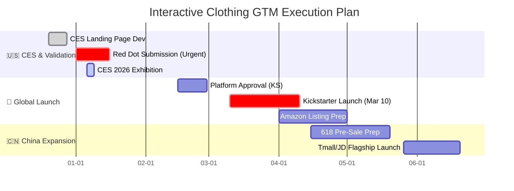

# 🚀 GTM Strategy & Persona Modeling: "Interactive Clothes"
### From Unstructured Data to Commercial Roadmap

*A comprehensive market analysis, commercial roadmap, and landing page implementation for a haptic wearable startup preparing for CES 2026 and global launch.*

---

## 📖 Executive Summary
**The Challenge:** A Shenzhen-based hardware startup developed a "haptic vest" with 12 vibration nodes but lacked a clear market fit. They initially targeted "general fitness," a saturated market with high customer acquisition costs.

**My Role:** As a Market Data Analyst & Frontend Contributor, I pivoted the strategy from "Fitness" to **"Somatic Wellness & Neuro-Engagement"**, identifying three unserved personas. I then engineered the **CES 2026 Landing Page** and a 6-month commercial roadmap spanning **CES (USA)** to **Kickstarter**, **Amazon**, and **618 (China)**.

---

## 🌐 Digital Execution: CES Landing Page
To capture leads at CES 2026, I co-developed a high-conversion Landing Page. I implemented a responsive design using **HTML5 & Tailwind CSS**, featuring custom-coded visual interactions to demonstrate the app interface.

### 🎥 Live Demo (Preview)

<table width="100%">
  <tr>
    <td width="45%" align="center">
      
    </td>
    <td width="10%">
        </td>
    <td width="45%" align="center">
      
    </td>
  </tr>
  <tr>
    <td align="center">
      <strong>Homepage Demo</strong> Fashion work demo & value proposition.
    </td>
    <td></td>
    <td align="center">
      <strong>PatPat & HufuLab Pages</strong> Detailed product specs & ecosystem research pages.
    </td>
  </tr>
</table>

### 📺 [Click Here to Watch the Full 1-Minute Walkthrough on YouTube](https://youtu.be/UrTLQHxSCOg)

---

## 📊 Market Analysis: The Pivot
> *See full analysis in [Market_Analysis_and_Personas.md](./Market_Analysis_and_Personas.md)*

By analyzing "frequency keywords" in reviews of competitors, I discovered that **"Morning Stiffness"** and **"Subscription Fatigue"** were the two biggest pain points.

| Competitor Weakness | Our Strategic Pivot |
| :--- | :--- |
| **"Hardware as a Service"** (Monthly Fees) | **"One Price, Lifetime Access"** |
| **"Athletic/Aggressive"** Branding | **"Gentle/Somatic"** Branding for Aging Parents |
| **"Setup Friction"** (Tripods/Mounts) | **"Wear & Play"** (Zero Setup Friction) |

---

## 🗓️ Commercial Roadmap (Gantt Chart)
> *See detailed timeline in [Launch_Timeline.md](./Launch_Timeline.md)*

I designed a "Export-to-Domestic" strategy: Building brand equity in the US (CES + Kickstarter) to drive premium sales in China.

---

## 🛠️ Tools & Technologies
* **Web Development**: HTML5, CSS3 (Grid/Flexbox), Tailwind CSS, WordPress
* **Data Analysis**: Python (Scrapy), Tableau, Excel
* **Strategy**: SWOT Analysis, Persona Modeling
